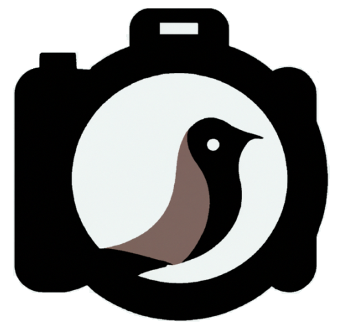
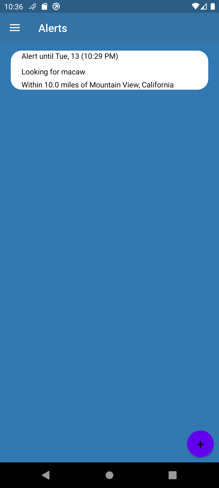
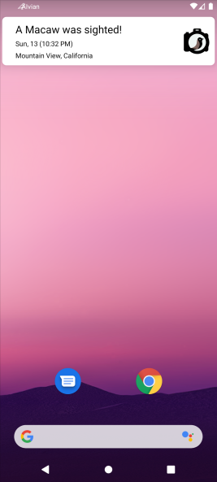

# AIvian


An application that leverages AI vision and user-friendly interface to provide a complete and supportive bird watching experience for novice to expert bird watchers.

## Repository Details

This repository contains only the releases of each product pipeline.  The development repositories are in [this Virginia Tech Git page](https://git.cs.vt.edu/aivian) and are behind access restrictions.  To gain access, please email brendanmolin@vt.edu

## Description
Bird watching has been a somewhat specialized activity seemingly reserved for scientists and a niche group of hobbyists. Experience and knowledge remain barriers to entry for prospective enthusiasts that want to take up the activity. We aim to provide a user-friendly application which leverages AI and provides the tools to allow any bird watchers, especially novice and casual users, to recognize and learn about birds in North America. In addition to providing guidance and information to beginners, the social networking aspects of our application will also connect users from a wide range of skill levels to enhance the bird watching experience through community participation and crowdsourcing.


## Technologies
* Frontend - The mobile application is written for the Android OS with a target SDK of 33 and minimum of 24.  The preferred IDE for development is Android Studio.  The code is written in Kotlin.
* Backend - the authentication, database, storage, and API were implemented with Firebase (Authentication, Firestore, Storage and Functions respectively) in NodeJS
* Deep Learning - code is written in Python using Pytorch with a ResNet pre-trained model.

## Installation

Frontend: 

Install latest version of Android Studio from https://developer.android.com/studio/

Backend: 

Fork the repo and clone it to your local setup

```git clone https://git.cs.vt.edu/aivian/aivian_backend.git```

Installing dependencies/packages:
* Make sure you have latest (16.17.1) Node.js installed: https://nodejs.org/en/download/
* Create a Firebase project: AIvian: https://firebase.google.com/
* Within the main directory of the backend folder, install the necessary packages
```npm install```
* Within the “functions” directory of the backend folder, install the necessary packages
```npm install```
* Login to Firebase
```firebase login```
* Make sure to add the service JSON file from the Firebase project settings into the “functions” folder  
* Follow the firebase documentation for writing, testing, and deploying the functions: https://firebase.google.com/docs/functions


## Feature Roadmap
* Log Bird Sightings
* Feed
* Species Classification
* Location and Date-Based Modeling
* Interactive Species Classification
* Crowdsourcing
* Alerts
* Groups
* Quizzes
* Session Tracking
* Search and Filter
* Recommendations
* Mass Upload
* Photo Saving
* Social Media Connections

## Authors and acknowledgment
* Aritra Majumdar
* Brendan Molin
* Conrad Pereira 
* Fan Yang 
* Rayaan Bokhari 
* Rehan Khan
* Suchith Suddala

## Project status
This project is in active development.

## Demo

The user begins at a login activity.  You have the option of creating an AIvian account or using your existing accounts with common providers like Google.


## Demo

The user begins at a login activity.  You have the option of creating an AIvian account or using your existing accounts with common providers like Google.


Users can log a bird sighting, adding photos from either their camera or from their device.  The user can set the location of the sighting on Google Maps, record the date and time of the sighting, and keep any notes they want to about the sighting.  Once a photo is entered, the user can request a species classification.  The AI model is stored to the local data to enable offline use.  It returns the top three species predictions, and the user has the option of confirming which species they believe is correct.


The user can go back to an old sighting and edit the details at any time.


Even when offline, the user can log their bird sightings and get species identification.  The app stores your own sightings locally first, and when there is internet access it will sync any additions, edits, and deletions you made with our remote servers, thus keeping your data stored remotely.  It accomplishes this by storing sync instructions in the device, and scheduling a background service to your device to call our API whenever internet access is restored.  As long as you remain logged in, those instructions will persist until it has been synced.  Logging out while sync is still pending will warn the user about the lost data.  Classifications are enabled offline because the model is compressed and stored in the device.


Users can add alert requests.  When you have an alert request, AIvian will send you notifications if another user adds a public observation that matches your alert settings.  Those settings can include a date range, a location and radius, and species names.





The Learning feature has users taking quizzes.  Quiz results are tracked so users can see their progress over time and their overall competency.  Each quiz is composed of questions that are constructed using data about bird species retrieved from the eBird API, which is managed by the Cornell Lab of Ornithology.  


Users can create, join, and invite others to Groups.  Groups allow people to share their observations with specific communities, and let each other know when they're going bird watching together.


